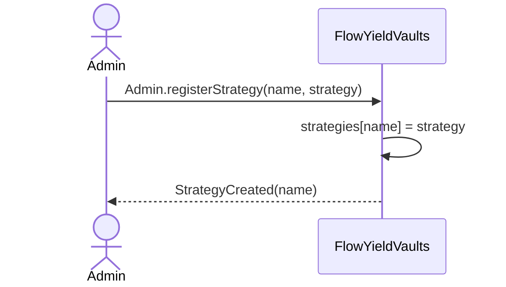
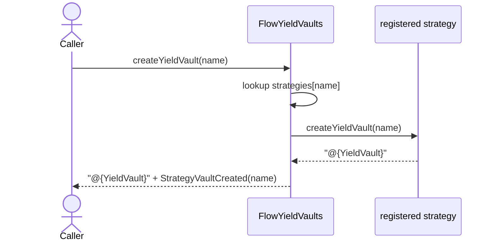
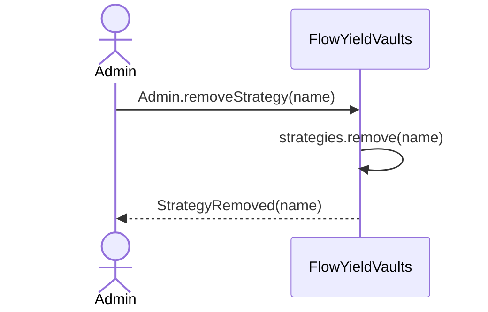

# Flow Yield Vaults — Core

## Overview

### Problem
Users want a single, composable primitive for opening a yield-generating position without having to understand or wire up the underlying strategy (lending, LP, basis trade, …). Each strategy has its own parameters (token types, swappers, health settings); the user should not have to care.

### Goal
Provide a registry (`FlowYieldVaults`) that admins populate with pre-configured **strategies**, and that mints a **yield vault** for any registered **name** on demand. The caller picks a strategy by name; the vault captures the strategy's parameters internally and exposes a uniform `FungibleToken.Provider` + `FungibleToken.Receiver` interface.

New strategy families are added by deploying a new strategy contract whose struct conforms to `FlowYieldVaultsInterfaces.Strategy`, and then `Admin.registerStrategy`ing an instance. Users always interact with the same `YieldVault` interface regardless of the strategy backing it.

### Relation to Early Access
During the launch phase, vault creation is gated by `FlowYieldVaultsEarlyAccess` (see [flow_yield_vaults_early_access.md](./flow_yield_vaults_early_access.md)). `FlowYieldVaults.createYieldVault` is `access(account)` for exactly this reason — only contracts on the same account (initially just early access) can reach it. After the early access period ends, a new implementation without the `access(account)` gate can be deployed under the same `FlowYieldVaultsInterfaces` interface.

## Nomenclature

| Term | Definition |
| :--- | :--------- |
| **Strategy** (`{Strategy}`) | A value conforming to `FlowYieldVaultsInterfaces.Strategy`. Encodes the parameters of a yield approach and knows how to mint a matching `YieldVault`. |
| **name** | The `String` identifier a strategy is registered under in `FlowYieldVaults`. Unique per registry. Used by callers to pick a strategy when minting a vault. Emitted in `StrategyCreated`, `StrategyRemoved`, and `StrategyVaultCreated`. |
| **Yield vault** (`YieldVault`) | A Cadence resource conforming to `FlowYieldVaultsInterfaces.YieldVault` (i.e. `FungibleToken.Provider` + `FungibleToken.Receiver`). Holds a user's yield-generating position. Produced by a strategy and held in the user's storage. |
| **Admin** | The holder of the `FlowYieldVaults.Admin` resource at `adminStoragePath` on the contract account. After deployment this is the deploying account. The `Admin` can be moved to transfer admin rights. |

## How it works

`FlowYieldVaults` stores every registered strategy by its `name`. The admin registers and removes strategies through an `Admin` resource saved in contract-account storage. Minting a vault from a `name` dispatches to the registered strategy, which produces a resource conforming to the uniform `YieldVault` interface.

### Strategy registration flow



Registering an already-used `name` panics — names are unique per registry.

### Vault creation flow



`Caller` is another contract on the same account (today: `FlowYieldVaultsEarlyAccess.EarlyAccessPass`). During the early access period no other caller exists. Tests side-step this by deploying an extra contract on the same account that exposes `createYieldVault` publicly (`TestYieldVaultGateway`).

### Strategy removal



Removing a strategy deletes the registry entry. Already-minted vaults are unaffected — they captured the strategy parameters at creation time and keep working. Further `createYieldVault(name)` calls panic until a new strategy is registered under that name.

## `FlowYieldVaults` — registry

### State

| Field | Access | Purpose |
| :---- | :----- | :------ |
| `adminStoragePath` | `access(all) let` | Storage path where the contract's `Admin` resource is saved on the contract account. |
| `strategies` | `access(self) let` | Map of `name → {Strategy}`. |

### Admin operations

```
Admin.registerStrategy(name: String, strategy: {FlowYieldVaultsInterfaces.Strategy})
```

Registers `strategy` under `name`. Panics with `"Strategy already registered: <name>"` if the name is already in use. Emits `StrategyCreated(name)`.

```
Admin.removeStrategy(name: String)
```

Removes the strategy registered under `name`. Panics with `"Strategy not found"` if unknown. Emits `StrategyRemoved(name)`.

### Read-only

```
strategyCount() → UInt64                              // current number of registered strategies
strategyInfos() → {String: {String: String}}         // map of name → strategy-provided metadata
```

Both are `view` and safe to call from any script. `strategyInfos` delegates each inner map to the strategy itself via `Strategy.info()` — `FlowYieldVaults` stores no metadata of its own.

### Access boundary

`FlowYieldVaults.createYieldVault` (the contract-level method) is `access(account)`. Only contracts deployed on the same account can call it directly. This is the hook `FlowYieldVaultsEarlyAccess` uses to gate vault creation behind an allowlist during launch. To open vault creation up, deploy a replacement contract on the same account that calls `FlowYieldVaults.createYieldVault` from its own (e.g. `access(all)`) entrypoint.

## Strategy contract

A strategy contract only needs to expose a struct conforming to `FlowYieldVaultsInterfaces.Strategy`:

```cadence
access(all) struct interface Strategy {
    access(all) fun createYieldVault(name: String): @{YieldVault}
    access(all) view fun info(): {String: String}
}
```

`createYieldVault` is the strategy's factory for yield vaults. The `name` it receives is the registry name the strategy was registered under — strategies are free to ignore it, log it, or use it as part of event payloads.

`info` returns a free-form key → value metadata map (e.g. `"description"`, `"protocol"`, `"asset"`). Each strategy picks what to expose; `FlowYieldVaults.strategyInfos()` surfaces these maps so UIs can list strategies without hard-coding their metadata.

The concrete yield vault resource must conform to:

```cadence
access(all) resource interface YieldVault: FungibleToken.Provider, FungibleToken.Receiver {}
```

— i.e. it implements the standard FT deposit/withdraw surface. That is the only contract a vault has with the outside world; everything strategy-specific lives inside.

The test suite uses `MockStrategy` as a minimal stand-in. Production strategy families (lending, LP, …) live on separate branches — e.g. `holyfuchs/yield-vaults-lending-strategy`.

## Failure modes

| Condition | Outcome |
| :-------- | :------ |
| `Admin.registerStrategy(name, …)` with a name already in use | Panics with `"Strategy already registered: <name>"`. |
| `Admin.removeStrategy(name)` with unknown `name` | Panics with `"Strategy not found"`. |
| `createYieldVault(name)` with unknown `name` | Panics with `"Strategy not found"`. |
| User transaction attempts to call `FlowYieldVaults.createYieldVault` directly | Access denied (`access(account)`). Must go through `FlowYieldVaultsEarlyAccess.EarlyAccessPass.createYieldVault`. |
| Admin resource is moved out of `adminStoragePath` | Admin-gated transactions can no longer borrow it; strategy registration and removal are blocked. Recoverable by moving the resource back. |

## Monitoring

| Contract | Event | Fields | Meaning |
| :------- | :---- | :----- | :------ |
| `FlowYieldVaults` | `StrategyCreated` | `name` | A strategy was registered under `name`. |
| `FlowYieldVaults` | `StrategyRemoved` | `name` | The strategy registered under `name` was removed. |
| `FlowYieldVaults` | `StrategyVaultCreated` | `name` | A yield vault was minted from the strategy registered under `name`. |

Strategy contracts may emit their own events on top of these (e.g. `LendingStrategyCreated` in a lending implementation). Those are additive; the events above are the core, strategy-agnostic signal.
