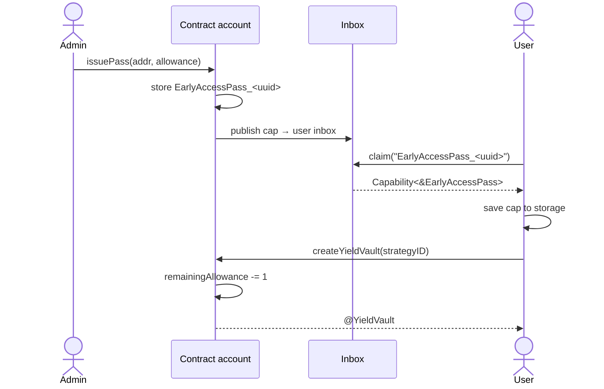

# Flow Yield Vaults — Early Access

Gates all yield vault creation to a manually approved allowlist. Only accounts that hold a valid `EarlyAccessPass` capability can create vaults, and each pass carries a finite allowance that decrements on use.


## How it works

The contract stores every `EarlyAccessPass` resource in the contract account. The admin issues a pass and publishes a capability to the recipient's inbox. The user claims it into their own storage and then calls through it to create yield vaults.



## Security proof

**Theorem.** No account can create a `YieldVault` unless the admin has explicitly issued it an `EarlyAccessPass` with sufficient remaining allowance.

**Proof.** We establish six claims:

- **Claim 1** — The underlying `createYieldVault` is unreachable by any user transaction directly.
- **Claim 2** — The only code path to `createYieldVault` passes through an `EarlyAccessPass` resource.
- **Claim 3** — An `EarlyAccessPass` can only be created by the admin and never leaves contract account storage.
- **Claim 4** — Only the intended recipient can obtain a capability to a given pass.
- **Claim 5** — The total number of vaults created through a pass can never exceed its allowance.
- **Claim 6** — Only the contract account can perform admin operations.

### Claim 1 — The interface boundary (`FlowYieldVaultsInterfaces`)

```cadence
access(account) fun createYieldVault(strategyID: UInt64): @{YieldVault}
```

`createYieldVault` is `access(account)`. It can only be called from a contract deployed on the **same account** — in this case `FlowYieldVaultsEarlyAccess`. A user transaction cannot call the underlying implementation directly.

### Claim 2 — The only path to `createYieldVault`

```cadence
access(all) resource EarlyAccessPass {
    access(all) fun createYieldVault(strategyID: UInt64): @{FlowYieldVaultsInterfaces.YieldVault} {
        // ...
        let vault <- fyv.createYieldVault(strategyID: strategyID)
        // ...
        return <- vault
    }
}
```

`fyv.createYieldVault` is only ever called from inside the `EarlyAccessPass` resource. To reach it, a caller must hold a live capability pointing to an `EarlyAccessPass` that still exists in contract storage.

### Claim 3 — The `EarlyAccessPass` resource lifecycle

```cadence
access(all) resource Admin {
    access(all) fun issuePass(to addr: Address, allowance: UInt64): UInt64 {
        let pass <- create EarlyAccessPass(allowance: allowance)
        let passUUID = FlowYieldVaultsEarlyAccess.storePass(pass: <- pass)
        // ...
    }

    access(all) fun revokePass(passUUID: UInt64) {
        let pass <- FlowYieldVaultsEarlyAccess.loadPass(passUUID: passUUID)
        destroy pass
        // ...
    }
}
```

The resource is only created in one location, immediately moved into contract account storage and never touches user storage. `loadPass` the only location which moves the resource out of storage calls `destroy` on it immediately after.
A user never has direct access to the resource.

### Claim 4 — The `EarlyAccessPass` capability

```cadence
access(all) resource Admin {
    access(all) fun issuePass(to addr: Address, allowance: UInt64): UInt64 {
        // ...
        let capability = self.account.capabilities.storage.issue<&EarlyAccessPass>(passStoragePath)
        self.account.inbox.publish(capability, name: inboxName, recipient: addr)
        // ...
    }
}
```

The capability is issued in exactly one location. It is published to the inbox addressed to a specific recipient, and no further action is taken with it.
Only the intended recipient can obtain a capability to the pass.

### Claim 5 — Only as many vaults can be created as the allowance

```cadence
access(all) resource EarlyAccessPass {
    access(all) var remainingAllowance: UInt64
    access(contract) fun setAllowance(_ newAllowance: UInt64) {
        self.remainingAllowance = newAllowance
    }

    access(all) fun createYieldVault(strategyID: UInt64): @{FlowYieldVaultsInterfaces.YieldVault} {
        pre { self.remainingAllowance > 0: "No remaining allowance" }
        self.remainingAllowance = self.remainingAllowance - 1
        // ...
    }

    init(allowance: UInt64) {
        self.remainingAllowance = allowance
    }
}

access(all) resource Admin {
    access(all) fun issuePass(to addr: Address, allowance: UInt64): UInt64 {
        let pass <- create EarlyAccessPass(allowance: allowance)
    }

    access(all) fun setAllowance(passUUID: UInt64, newAllowance: UInt64) {
        let pass = FlowYieldVaultsEarlyAccess.borrowPass(passUUID: passUUID)
        pass.setAllowance(newAllowance)
    }
}
```

`EarlyAccessPass.setAllowance` is `access(contract)` — unreachable through an `&EarlyAccessPass` capability reference. `remainingAllowance` is set exactly once at construction via `init`, and can only be written thereafter through the `Admin` resource. The number of vaults created can never exceed the allowance set by the admin.

### Claim 6 — The `Admin` resource

```cadence
access(all) contract FlowYieldVaultsEarlyAccess {
    init() {
        // ...
        self.account.storage.save(<- create Admin(), to: self.adminStoragePath)
    }
}
```

`Admin` is created exactly once in `init` and saved directly to contract account storage. No capability is ever issued for it.
No external account can perform admin operations.
