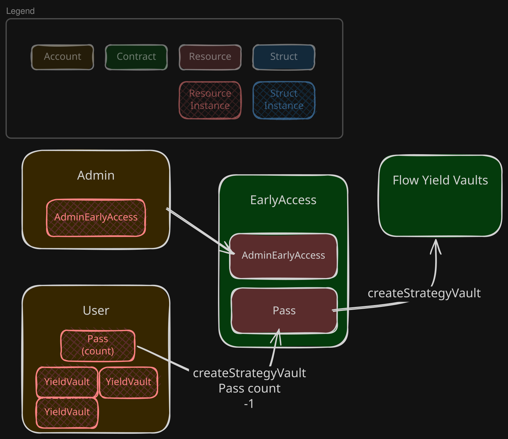
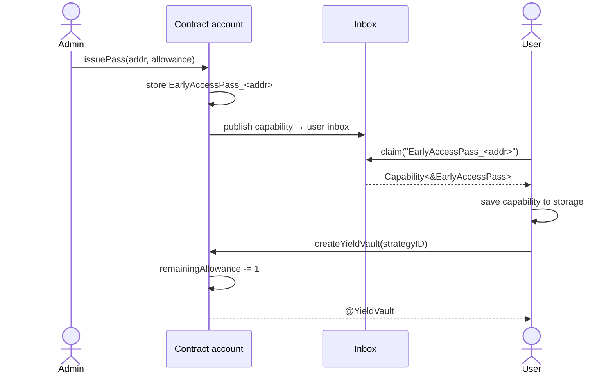
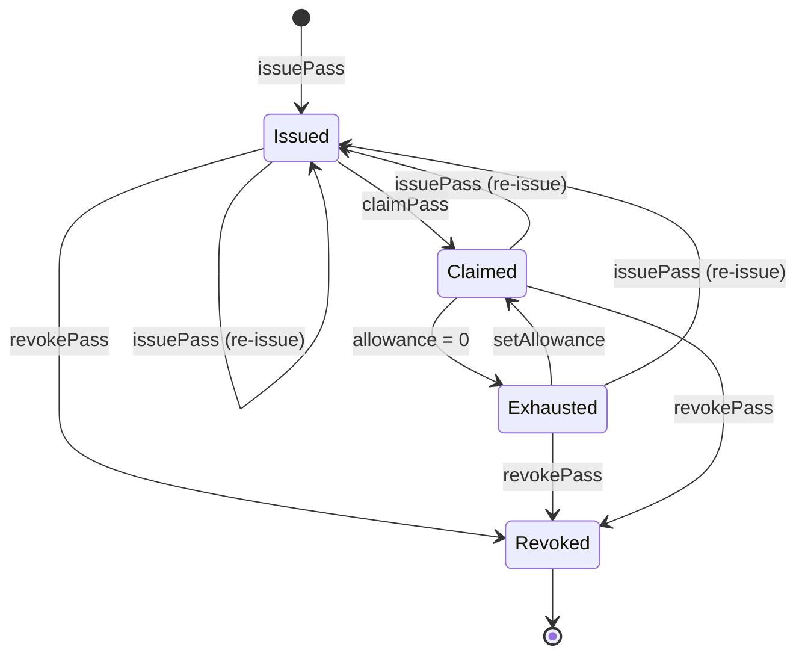

# Flow Yield Vaults — Early Access

## Overview

### Problem
During the launch phase, yield vault creation must be restricted to vetted participants. An open deployment would expose the protocol to malicious actors before the system has been stress-tested in production. Participants are semi-trusted — we can reasonably assume they will not behave maliciously.

### Goal
Gate yield vault creation behind an allowlist curated by us. Each approved participant receives one `EarlyAccessPass` with an allowance — a fixed number of yield vaults they may create. One pass equals one participant; the allowance is the cap on how many vaults that participant can open. If a participant misbehaves, the admin revokes their pass, immediately blocking any further vault creation. This limits exposure in the event of a leaked capability: the blast radius is bounded by the allowance on that specific pass and the capital permitted per vault.

### Lifetime
This is a **temporary** restriction. `FlowYieldVaultsEarlyAccess` is a thin wrapper over `FlowYieldVaults` with no state in the underlying contract. Removing early access requires updating `FlowYieldVaults` to remove the `access(account)` gate on `fun createYieldVault`. After that, vault creation is open to anyone — no pass and no allowance required. `FlowYieldVaultsEarlyAccess` remains deployed but becomes a dead entrypoint; existing passes are irrelevant since users will interact with `FlowYieldVaults` directly.

## Nomenclature

| Term | Definition |
| :--- | :--------- |
| **Vault** (`YieldVault`) | A Cadence resource representing a yield-generating position. |
| **Pass** (`EarlyAccessPass`) | A Cadence resource stored in contract account storage. Represents a grant of vault-creation rights. Never held by the user directly. Keyed by recipient address: each address has at most one pass at a time. |
| **Access to a pass** (`Capability<&EarlyAccessPass>`) | A capability pointing to a pass. The only object the user holds. Grants access to `access(all)` functions on the pass, which includes `createYieldVault`. Becomes dead (unborrow-able) when the underlying pass is destroyed or its capability controller is deleted. |
| **addr** | The recipient address a pass is issued to. Used as the primary key for all admin operations and emitted in every event. |
| **Allowance** (`remainingAllowance`) | The number of vaults the holder of access to a pass may still create. |
| **strategyID** | An identifier passed to `createYieldVault` that selects which yield strategy the vault should use. Defined by the underlying `FlowYieldVaults` implementation. |
| **Admin** | The holder of the `Admin` resource. After deployment this is the deploying account. The `Admin` resource can be moved to transfer admin rights. |

## How it works



The contract stores every `EarlyAccessPass` resource in the contract account, keyed by recipient address. The admin issues a pass and publishes a capability to the recipient's inbox. The user claims it into their own storage and then calls through it to create yield vaults.

### Issuance and vault creation flow



### Pass lifecycle



`Claimed → Exhausted` is triggered by `createYieldVault` when allowance reaches 0, or directly by `setAllowance(0)`. `Exhausted → Claimed` is triggered by `setAllowance(n > 0)`. `issuePass` on an address that already holds a pass replaces its allowance and invalidates any previously issued capability — the recipient must claim the new capability. Revoked is terminal — no transition out.

## Invariants

The implementation must maintain the following invariants at all times:

- **(I)** The total number of `YieldVault`s created through the pass issued to address A never exceeds the allowance set for A at its most recent `issuePass` or `setAllowance` call.
- **(II)** A `YieldVault` can only be created by an account holding a live capability to a pass P that was issued by the admin and has not been revoked.
- **(III)** An `EarlyAccessPass` resource never exists outside contract account storage.
- **(IV)** At any point in time, each address holds at most one `EarlyAccessPass`.
- **(V)** The `Admin` resource can only be operated by a transaction signed by the contract account.

## Security proof

**Theorem.** No account can create a `YieldVault` unless the admin has explicitly issued it an `EarlyAccessPass` with sufficient remaining allowance.

**Proof.** We establish the following claims, each proving one or more of the invariants stated above:

- **Claim 1** — The underlying `createYieldVault` is unreachable by any user transaction directly. *(supports II)*
- **Claim 2** — The only code path to `createYieldVault` passes through an `EarlyAccessPass` resource. *(supports II)*
- **Claim 3** — An `EarlyAccessPass` can only be created by the admin and never leaves contract account storage. *(establishes III, supports II and IV)*
- **Claim 4** — Only the intended recipient can obtain access to a given pass. *(supports II)*
- **Claim 5** — The total number of vaults created through a pass can never exceed its allowance. *(establishes I)*
- **Claim 6** — Only the contract account can perform admin operations. *(establishes V)*

Claims 1–4 together establish invariant (II): to create a vault, a caller must hold live access to a pass that the admin issued and has not revoked. Claim 3, combined with the address-keyed storage path, establishes invariant (IV). Claim 5 establishes invariant (I). Claim 6 establishes invariant (V). The theorem follows.

### Claim 1 — The `access(account)` gate

```cadence
access(account) fun createYieldVault(strategyID: UInt64): @YieldVault
```

`createYieldVault` is `access(account)`. It can only be called from a contract deployed on the **same account** — in this case `FlowYieldVaultsEarlyAccess`. A user transaction cannot call the underlying implementation directly.

### Claim 2 — The only path to `createYieldVault`

```cadence
access(all) resource EarlyAccessPass {
    access(all) fun createYieldVault(strategyID: UInt64): @FlowYieldVaults.YieldVault {
        // ...
        let vault <- FlowYieldVaults.createYieldVault(strategyID: strategyID)
        // ...
        return <- vault
    }
}
```

`FlowYieldVaults.createYieldVault` is only ever called from inside the `EarlyAccessPass` resource. To reach it, a caller must hold a live capability pointing to an `EarlyAccessPass` that still exists in contract storage.

### Claim 3 — The `EarlyAccessPass` resource lifecycle

```cadence
access(all) resource Admin {
    access(all) fun issuePass(to addr: Address, allowance: UInt64) {
        let path = FlowYieldVaultsEarlyAccess.passStoragePath(addr: addr)
        if FlowYieldVaultsEarlyAccess.checkPass(addr: addr) {
            let pass = FlowYieldVaultsEarlyAccess.borrowPass(addr: addr)
            pass.setAllowance(allowance)
            FlowYieldVaultsEarlyAccess.deletePassCapabilities(addr: addr)
        } else {
            let pass <- create EarlyAccessPass(addr: addr, allowance: allowance)
            FlowYieldVaultsEarlyAccess.account.storage.save(<- pass, to: path)
        }
        // ...
    }

    access(all) fun revokePass(addr: Address) {
        let pass <- FlowYieldVaultsEarlyAccess.loadPass(addr: addr)
        destroy pass
        // ...
    }
}
```

Cadence restricts `create EarlyAccessPass` to the defining contract — no external code can construct one. The resource is immediately moved into a deterministic, address-keyed path in contract account storage (`FlowYieldVaultsEarlyAccessPass_<addr>`) and never touches user storage. `loadPass`, the only location that moves the resource out of storage, calls `destroy` immediately after. Once destroyed, any capability pointing at that path returns `nil` on `borrow()`.

Because the storage path is a deterministic function of `addr`, and `issuePass` reuses the existing resource when one is already present, an address can never hold more than one pass simultaneously — establishing invariant (IV).

### Claim 4 — The `EarlyAccessPass` capability

```cadence
access(all) resource Admin {
    access(all) fun issuePass(to addr: Address, allowance: UInt64) {
        // ...
        let capability = self.account.capabilities.storage.issue<&EarlyAccessPass>(passStoragePath)
        self.account.inbox.publish(capability, name: inboxName, recipient: addr)
    }
}
```

The capability is issued in exactly one location. It is published to the inbox addressed to a specific recipient, and no further action is taken with it. Cadence's `inbox.claim` requires the claimer to be the transaction signer matching the recipient address — no third party can intercept it.
Only the intended recipient can obtain access to the pass.

### Claim 5 — Only as many vaults can be created as the allowance

```cadence
access(all) resource EarlyAccessPass {
    access(all) var remainingAllowance: UInt64
    access(contract) fun setAllowance(_ newAllowance: UInt64) {
        self.remainingAllowance = newAllowance
    }

    access(all) fun createYieldVault(strategyID: UInt64): @FlowYieldVaults.YieldVault {
        pre { self.remainingAllowance > 0: "No remaining allowance" }
        self.remainingAllowance = self.remainingAllowance - 1
        // ...
    }

    init(addr: Address, allowance: UInt64) {
        self.addr = addr
        self.remainingAllowance = allowance
    }
}

access(all) resource Admin {
    access(all) fun issuePass(to addr: Address, allowance: UInt64) {
        // either create with allowance, or call setAllowance on existing pass
        // ...
    }

    access(all) fun setAllowance(addr: Address, newAllowance: UInt64) {
        let pass = FlowYieldVaultsEarlyAccess.borrowPass(addr: addr)
        pass.setAllowance(newAllowance)
    }
}
```

`EarlyAccessPass.setAllowance` is `access(contract)` — unreachable through an `&EarlyAccessPass` capability reference. `remainingAllowance` is set exactly once at construction via `init`, and can only be written thereafter through the `Admin` resource. The number of vaults created can never exceed the allowance set by the admin.

### Claim 6 — The `Admin` resource

```cadence
access(all) contract FlowYieldVaultsEarlyAccess {
    init() {
        // ...
        self.account.storage.save(<- create Admin(), to: self.adminStoragePath)
    }
}
```

`Admin` is created exactly once in `init` and saved directly to contract account storage. No capability is ever issued for it.
No external account can perform admin operations.

## Admin operations

### Granting access

```
issuePass(to addr: Address, allowance: UInt64)
```

Issues a pass to `addr` and publishes the capability to their inbox. If a pass already exists for `addr`, its `remainingAllowance` is replaced with the new `allowance` and any previously issued capability controllers are deleted — invalidating any capability the recipient has already claimed. A fresh capability is then issued and published to the inbox, which the recipient must claim before they can create vaults again.

### Revoking access

```
revokePass(addr: Address)
```

Destroys the pass resource and deletes all capability controllers associated with it, immediately invalidating any capability the recipient holds — `borrow()` will return `nil` and all further vault creation attempts will fail. If the pass has not yet been claimed, the inbox entry is also retracted. Panics if no pass exists for `addr`.

### Adjusting allowance

```
setAllowance(addr: Address, newAllowance: UInt64)
```

Replaces the remaining allowance on an existing pass. Can be used to increase, decrease, or set to `0` to temporarily block vault creation without revoking the pass. Setting back to a non-zero value re-enables creation.

### Re-issuing to the same address

Calling `issuePass` on an address that already holds a pass reuses the same underlying resource, replaces its allowance, and deletes all previously issued capability controllers — any capability the recipient already claimed becomes dead. A fresh capability is published to the inbox and must be re-claimed before vault creation can resume.

Revoking and then issuing is equivalent from the user's perspective, but goes through a terminal `Revoked` state and creates a brand-new resource.

## Contract with callers

### Requirements on the admin

- **(A1)** The contract account must not deploy additional contracts that call `access(account)` functions on `FlowYieldVaults`. Doing so would bypass the gate and violate invariant (II).
- **(A2)** The contract account's signing key must be kept secure. Compromise of the key grants full admin power.

### Requirements on the user

- **(U1)** The user must claim access to the pass from their inbox before attempting vault creation. Unclaimed access cannot be used.
- **(U2)** After a re-issue, the user must re-claim the new capability; the previously claimed one is dead.
- **(U3)** The user must not share their capability with untrusted parties. Any account that can borrow the capability can consume allowance.

## Failure modes

| Condition | Outcome |
| :-------- | :------ |
| User never claims access to the pass | Pass remains in contract storage indefinitely; no vault can be created through it. Admin can revoke to clean up. |
| Pass revoked before claim | Inbox entry is retracted and the controller is deleted; user cannot claim access. Vault creation is permanently blocked for that pass. |
| Pass revoked after claim | Capability controllers are deleted and the resource is destroyed; the held capability is dead (`borrow()` returns `nil`); all further vault creation attempts panic. |
| `setAllowance(0)` called | Vault creation is blocked; capability remains live. Re-enabled by a subsequent `setAllowance` with a non-zero value. |
| `issuePass` called on an address with an existing pass | Allowance is replaced; any previously claimed capability is dead; a fresh capability is published to the inbox and must be re-claimed. |

## Monitoring

All significant state changes emit events. Querying the event history is the primary way to read operational state (e.g. which addresses currently hold passes and their allowances).

| Event | Fields | Meaning |
| :---- | :----- | :------ |
| `PassIssued` | `addr`, `allowance` | A pass was issued (or re-issued) to `addr` with the given allowance. |
| `PassRevoked` | `addr` | The pass for `addr` was destroyed; any held capability is now dead. |
| `PassUsed` | `addr`, `remainingAllowance` | A vault was created through the pass for `addr`; `remainingAllowance` reflects the value after decrement. |
