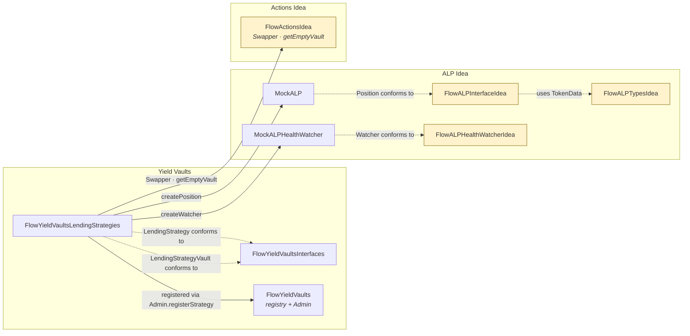

# Flow Yield Vaults — Lending Strategy

> **Status: prototype.** This strategy depends on `FlowALPInterfaceIdea`,
> `FlowALPTypesIdea`, `FlowALPHealthWatcherIdea`, and `FlowActionsIdea` —
> all tagged as drafts subject to change. Mocks (`MockALP`,
> `MockALPHealthWatcher`, `MockSwapper`, `MockToken`) stand in for the real
> ALP, swap venues, and tokens until those designs land.

## Overview

### Goal
Provide the first concrete `{FlowYieldVaultsInterfaces.Strategy}` so the
yield-vaults registry has something real to mint. The strategy earns yield by
posting collateral into an ALP lending market, borrowing debt against it, and
swapping that debt into a yield-bearing token.

### Shape
A `LendingStrategy` is a struct carrying the parameters of one such loop:

| Field | Meaning |
| :---- | :------ |
| `collateralTokenType` | Token posted as collateral. |
| `debtTokenType`       | Token borrowed against the collateral. |
| `yieldTokenType`      | Token the borrowed debt is swapped into to earn yield. |
| `collateralDebtSwapper` | `{FlowActionsIdea.Swapper}` used to move between collateral and debt when rebalancing/unwinding. |
| `debtYieldSwapper`    | `{FlowActionsIdea.Swapper}` used to swap debt → yield token. |

Strategies are constructed through `FlowYieldVaultsLendingStrategies.createLendingStrategy(...)` (emits `LendingStrategyCreated`) and then registered in the `FlowYieldVaults` registry by name via `Admin.registerStrategy`.

## Per-vault state

Every yield vault minted from a `LendingStrategy` is a
`LendingStrategyVault` resource, produced by `Strategy.createYieldVault(name)`
and captured under the registry `name`. Each vault holds:

- a **copy of the `LendingStrategy`** it was minted from — strategy
  parameters are frozen at creation time, so later `removeStrategy` /
  re-register cycles do not mutate existing vaults;
- an **`@{FlowALPInterfaceIdea.ALPPosition}`** — the lending-market position,
  created at vault-creation time via `MockALP.createPosition()` and the only
  place ALP state is held;
- an **`@{FlowALPHealthWatcherIdea.Watcher}`** — a watcher handle, created
  via `MockALPHealthWatcher.createWatcher()`, wired up once the real
  callback/trigger design lands;
- a **`@{FungibleToken.Vault}`** of the yield token — the vault's actual
  earnings balance.

The ALP position and health watcher are intentionally created inside
`createYieldVault`, not on the strategy itself — the strategy is a shared,
immutable value-type; state lives on the vault.

## How it fits in

Yellow nodes are the draft "Idea" contracts — their signatures will be
replaced by the real designs without touching the registry layer.

## Lifecycle

1. **Construct** — `FlowYieldVaultsLendingStrategies.createLendingStrategy(...)` returns a `LendingStrategy` struct and emits `LendingStrategyCreated`.
2. **Register** — `FlowYieldVaults.Admin.registerStrategy(name, strategy)` stores it under `name` (emits `StrategyCreated(name)`).
3. **Mint** — `FlowYieldVaults.createYieldVault(name)` (or `Admin.createYieldVault`) dispatches to the stored strategy's `createYieldVault(name)`, which constructs the `LendingStrategyVault`, attaches a fresh ALP position + watcher, and emits `LendingStrategyVaultCreated` + `StrategyVaultCreated(name)`.
4. **Use** — the user saves the vault in their storage and interacts with it through the `FungibleToken.Provider` / `Receiver` surface. Deposit/withdraw logic currently `panic("TODO")` — see Current status.

## Current status

| Piece | State |
| :---- | :---- |
| Strategy struct + registration flow | Implemented, tested. |
| Event surface (`LendingStrategyCreated`, `LendingStrategyVaultCreated`) | Implemented. |
| Per-vault ALP position + health watcher wiring | Implemented against `Mock*`. |
| `deposit` / `withdraw` / `isAvailableToWithdraw` / `getSupportedVaultTypes` / `isSupportedVaultType` on the vault | `panic("TODO")` — awaits real ALP semantics. |
| Real ALP, swap venues, health watcher | Not in this repo. Mocks exist only to unblock the yield-vaults layer. |

## Monitoring

| Event | Fields | Meaning |
| :---- | :----- | :------ |
| `FlowYieldVaultsLendingStrategies.LendingStrategyCreated` | — | A `LendingStrategy` struct was constructed. Pairs with `FlowYieldVaults.StrategyCreated(name)` when the caller registers it. |
| `FlowYieldVaultsLendingStrategies.LendingStrategyVaultCreated` | — | A `LendingStrategyVault` resource was constructed. Pairs with `FlowYieldVaults.StrategyVaultCreated(name)`. |
