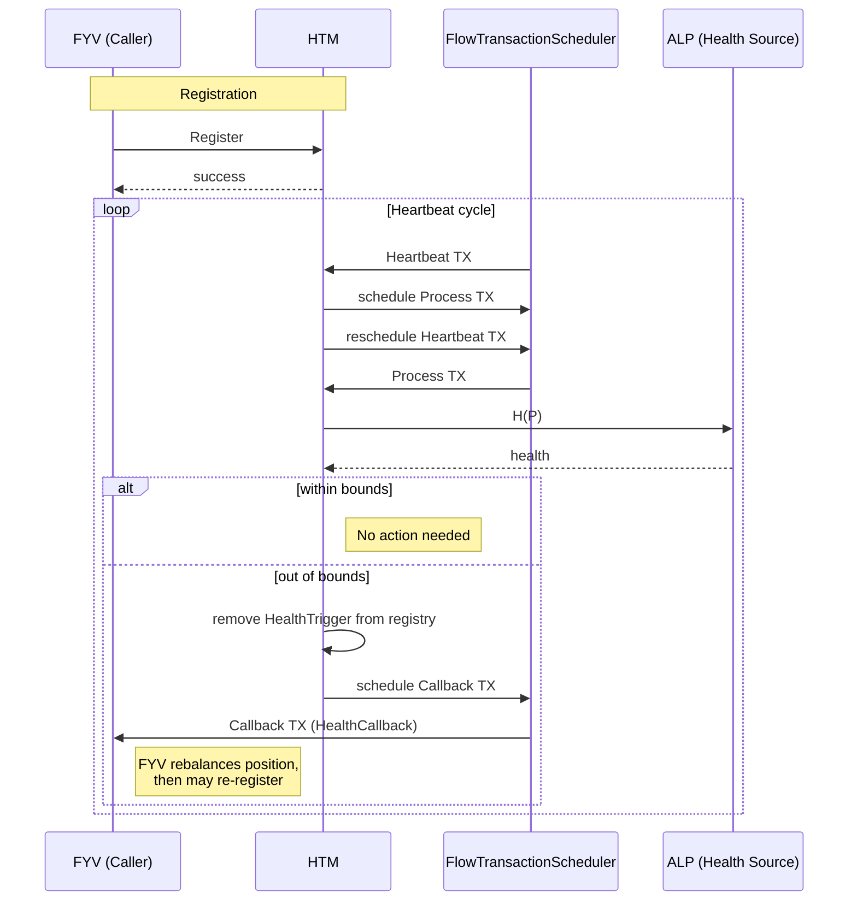
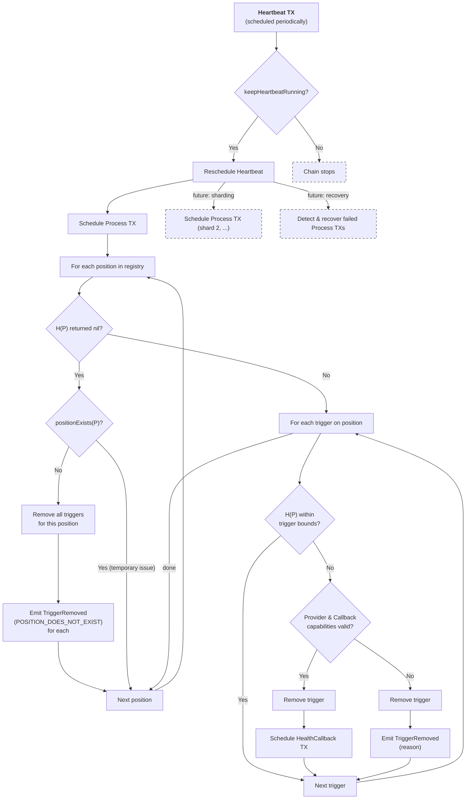

# Health Trigger Manager (HTM)

> **Scope:** Everything in this document describes the v0.2 design unless explicitly stated otherwise. Features beyond v0.2 are collected in [Future Expansions](#8-future-expansions).

## 1 Motivation

As market conditions change, the health of each ALP position drifts. When a position's health drops too low, it must be liquidated; when it climbs too high, rebalancing may be needed. Rather than requiring external keepers or manual intervention, FCM needs an on-chain component that periodically evaluates position health and triggers the appropriate response (e.g. FYV rebalancing) when health leaves acceptable bounds. Since the component is already evaluating every position's health, it can also notify any other subscriber that wishes to react when health crosses caller-defined thresholds.

## 2 Summary

The Health Trigger Manager (**HTM**) periodically checks the health of all of its registered positions and fires a callback when a position's health goes out of bounds. The callback is fired exactly once; the trigger is then removed from the registry. Once the callback has adjusted the health, it can re-register the trigger.



## 3 Design

### HealthTrigger

A `HealthTrigger` contains:

1. Optional upper ($$H_{\textbf{max}}$$) and/or lower ($$H_{\textbf{min}}$$) health bounds (`UFix64?`), both inclusive. At least one bound must be specified. A trigger is within bounds if $$H_{\textbf{min}} \leq H(P) \leq H_{\textbf{max}}$$, where an omitted bound is treated as satisfied.
2. A callback capability (`Capability<auth(FlowTransactionScheduler.Execute) &{FlowTransactionScheduler.TransactionHandler}>`) to be scheduled exactly once after the position's health goes out of bounds. The callback is parameterless — the HTM passes `data: nil` when scheduling, and the caller's `executeTransaction` implementation is responsible for querying the current position state itself.
3. A provider capability (`Capability<auth(FungibleToken.Withdraw) &FlowToken.Vault>`) used to pay for scheduling the callback.
4. The execution effort (`UInt64`) for the callback TX. Must be within `[FlowTransactionScheduler.getConfig().minimumExecutionEffort, FlowTransactionScheduler.getConfig().maximumIndividualEffort]`.
5. The scheduling priority (`FlowTransactionScheduler.Priority`) for the callback TX.

All fields are plain data or opaque capability handles. No user code is called when reading or validating a `HealthTrigger` — the only user code that runs is `executeTransaction`, which executes in its own isolated scheduled TX.

A single position can have multiple triggers with different bounds and callbacks (e.g. one for rebalancing, one for liquidation).

### Registry

The registry is keyed by position ID ($$P$$ = `position.id`, i.e. the Position resource's UUID). Each entry contains a list of `HealthTrigger` objects for that position.

Position health is obtained via `FlowALP.Pool.getPositionHealth(positionID)`, which returns `UFix64?`. A `nil` return means the health could not be determined (see [Process](#process) for how this case is handled). The **HTM** holds a single `Capability<&FlowALP.Pool>` as a contract-level dependency, set at init and changeable by admin. This ensures [Process](#process) calls the health function only once per position, regardless of how many triggers are registered for it.

The **HTM** also depends on `FlowALP.Pool.positionExists(positionID)` to disambiguate a `nil` health return (position gone vs. temporary issue such as an oracle being unavailable).

### Registration

To register a health trigger the caller provides a position ID and the five fields of a `HealthTrigger`:

```cadence
access(all) fun register(
    positionID: UInt64,
    hMin: UFix64?,
    hMax: UFix64?,
    callback: Capability<auth(FlowTransactionScheduler.Execute) &{FlowTransactionScheduler.TransactionHandler}>,
    provider: Capability<auth(FungibleToken.Withdraw) &FlowToken.Vault>,
    executionEffort: UInt64,
    priority: FlowTransactionScheduler.Priority
)
```

If the position already has an entry in the registry, the new trigger is appended to the existing entry's trigger list.

**Bounds:** A trigger may specify only a lower bound, only an upper bound, or both. For example, a liquidation trigger only needs a lower bound, while a rebalancing trigger typically specifies both.

**Validation:** Registration does not evaluate $$H(P)$$. It is valid to register triggers for positions that are already out of bounds, do not exist yet, or whose health cannot currently be determined. Process will handle these cases on the next cycle.

Registration is rejected if:

- At least one bound is not specified.
- `priority` is `High`. High priority is reserved for the scheduler's internal use and can panic if the requested time slot is full. Only `Low` and `Medium` are accepted for callbacks.
- `executionEffort` is outside `[FlowTransactionScheduler.getConfig().minimumExecutionEffort, FlowTransactionScheduler.getConfig().priorityEffortLimit[priority]]`. This is a tighter bound than `maximumIndividualEffort` — each priority level has its own effort pool, and exceeding it would cause `schedule()` to panic.
- The `callback` capability does not exist (i.e. `callback.check()` fails).
- The `provider` capability does not exist or has insufficient funds. "Sufficient funds" means `provider.borrow().balance >= FlowTransactionScheduler.calculateFee(executionEffort: executionEffort, priority: priority, dataSizeMB: 0.0)`.

These capabilities are validated at registration but may become unavailable later (see [`TriggerRemoved`](#events) event).

**Return value:** Registration never panics. It returns a boolean indicating success or failure. On success, emits `TriggerRegistered`. All validation checks use non-panicking operations (capability `check()`, optional chaining, value comparisons).

**Access control:** Registration is public. Since the registering party pays for callback execution (via the `provider` capability), there is no execution cost to the protocol and no need for additional permissioning. Storage costs are absorbed by the **HTM** account for now (see [Future Expansions](#8-future-expansions)).

### Scheduling

The **HTM** uses two scheduled transactions: **Heartbeat** and **Process**. Heartbeat schedules a Process TX and then reschedules itself. Separating the two ensures that the Heartbeat chain always continues, even if Process fails, and leaves room for future recovery and scaling logic inside Heartbeat.

**Configuration:**

- `HeartbeatInterval`: how often health triggers are checked. Must be between 1s and 1 day (86 400s). Can be changed by admin at any time; the new value is picked up on the next Heartbeat reschedule.
- Operational-costs vault capability: used to fund the Heartbeat and Process scheduled transactions the **HTM** creates. Out-of-bounds callbacks pay for themselves via the supplied `Provider` capability. Defaults to the HTM account's own FlowToken vault at init; can be changed via an admin function.
- `keepHeartbeatRunning` (Bool): controls whether the Heartbeat chain continues. When `true`, each Heartbeat reschedules itself; when `false`, the chain stops after the current cycle. Defaults to `true`. Setting this value requires admin entitlements.
- `minHeartbeatExecutionEffort` (UInt64): the execution effort used when scheduling Heartbeat TXs, set to `max(FlowTransactionScheduler.minimumExecutionEffort, minHeartbeatExecutionEffort)`. Defaults to `50`. Setting this value requires admin entitlements.

**Transaction types:**

- **Heartbeat** checks `keepHeartbeatRunning`. If `true`, it reschedules itself (timestamp: now + HeartbeatInterval) and schedules one or more Process TXs. If `false`, it does not reschedule and the chain stops. Heartbeat is scheduled with execution effort `max(FlowTransactionScheduler.minimumExecutionEffort, minHeartbeatExecutionEffort)`. In the future it may schedule multiple Process TXs (e.g., one per shard) and detect/recover failed ones.
- **Process** is scheduled at now + 1s with execution effort returned by `HTM.estimateProcessExecutionEffort()` (must not panic). For now this function returns `9999` (see [Future Expansions](#8-future-expansions) item 4). See [Process](#process) for the full processing logic. Process is public — anyone can call it directly (e.g. via a regular transaction) without waiting for the next Heartbeat cycle. This is safe because Process is idempotent and all callback costs are borne by the registrants' `Provider` capabilities, not by the caller. The caller only pays normal transaction fees for the Process TX itself.
- **Callback TX** is the caller's `TransactionHandler` scheduled directly via `FlowTransactionScheduler.schedule()` at now + 1s with the trigger's `executionEffort` and `priority`. It runs in isolation — a panic in one callback does not affect others or the Process/Heartbeat chain. See [HealthCallback](#healthcallback).

Heartbeat and Process TXs use Low priority. Callback TXs use the priority specified at registration (Low or Medium only — High is not allowed, see [Registration](#registration)).

An admin-only `startHeartbeat()` function sets `keepHeartbeatRunning` to `true` and schedules the first Heartbeat TX to bootstrap the chain. The same function is used to restart the chain after it has stopped (see [Recovery](#recovery)). Calling `startHeartbeat()` while a chain is already running creates a redundant parallel chain — this wastes operational funds but is not unsafe (Process is idempotent). The admin should verify the chain is stopped (absence of `HeartbeatRescheduled` events) before calling `startHeartbeat()`.

The `@ScheduledTransaction` resources returned by `FlowTransactionScheduler.schedule()` are destroyed immediately after scheduling. The **HTM** does not need to cancel or track individual scheduled transactions — the `keepHeartbeatRunning` flag controls whether the Heartbeat chain continues.

### Process

Process iterates over every position in the registry. For each position it evaluates health once, then checks all of that position's triggers against the result.

**1. Evaluate health.** Call $$H(P)$$ once for the position.

- If $$H(P)$$ returns `nil`, call `positionExists(P)` to disambiguate:
  - Position does not exist → remove all triggers for this position and emit `TriggerRemoved` with reason `"TRIGGER_POSITION_DOES_NOT_EXIST"` for each. Continue to the next position.
  - Position exists (temporary issue, e.g. oracle unavailable) → skip the position; all its triggers remain in the registry for the next cycle. Continue to the next position.

**2. For each trigger on the position:**

- If $$H_{\textbf{min}} \leq H(P) \leq H_{\textbf{max}}$$ (within bounds) → no action. Continue to the next trigger.
- The trigger is out of bounds. Validate capabilities:
  - The `callback` capability still exists (`callback.check()`).
  - The `provider` capability still exists and has sufficient balance to cover `FlowTransactionScheduler.calculateFee(executionEffort: trigger.executionEffort, priority: trigger.priority, dataSizeMB: 0.0)`.
- If any check fails, remove the trigger and emit `TriggerRemoved` with the corresponding reason string (see [Events](#events)). Continue to the next trigger.
- Capabilities valid → before scheduling, re-validate that `executionEffort` is still within `[FlowTransactionScheduler.getConfig().minimumExecutionEffort, FlowTransactionScheduler.getConfig().priorityEffortLimit[priority]]` (scheduler config may have changed since registration). If invalid, remove the trigger and emit `TriggerRemoved` with reason `"TRIGGER_EXECUTION_EFFORT_INVALID"`. Otherwise, remove the trigger from the registry, withdraw the fee from the `provider`, and schedule the `callback` via `FlowTransactionScheduler.schedule(handlerCap: trigger.callback, data: nil, ...)`. Emit `CallbackScheduled`.

After all positions have been processed, emit `PositionsProcessed` with the number of positions and triggers checked.

Process is idempotent — running it twice in the same cycle is safe because triggers are removed before their callbacks are scheduled.



### HealthCallback

The caller's callback is a resource implementing `FlowTransactionScheduler.TransactionHandler`, stored in the caller's account. When a trigger fires, the HTM passes the caller's `callback` capability directly to `FlowTransactionScheduler.schedule()` with `data: nil`. The scheduler invokes `executeTransaction(id:, data:)` on the caller's resource; the caller's implementation should ignore both parameters and query the current position state itself.

**Panic isolation:** The callback could panic. Because each callback runs in its own scheduled transaction, a panicking callback only reverts its own TX — it does not affect other callbacks, the Process TX, or the Heartbeat chain. No user code runs during Process itself — Process only reads capability handles, FlowToken vault balances, and Pool state.

### Funding

The **HTM** holds a capability to an operational-costs vault. It draws from this vault to fund the Heartbeat and Process scheduled transactions. Callback TXs are funded by withdrawing the exact fee (computed via `FlowTransactionScheduler.calculateFee()`) from the `provider` capability supplied at registration.

### Events

```cadence
access(all) event HeartbeatRescheduled(
    timestamp: UFix64           // scheduled timestamp of the next Heartbeat
)

access(all) event PositionsProcessed(
    positionCount: UInt64,      // number of positions evaluated
    triggerCount: UInt64         // number of triggers evaluated
)

access(all) event TriggerRegistered(
    positionID: UInt64,
    hMin: UFix64?,
    hMax: UFix64?,
    callbackAddress: Address,   // address that owns the TransactionHandler resource
    executionEffort: UInt64,
    priority: UInt8             // raw value of FlowTransactionScheduler.Priority
)

access(all) event CallbackScheduled(
    positionID: UInt64,
    hMin: UFix64?,
    hMax: UFix64?,
    callbackAddress: Address,
    health: UFix64,             // the computed H(P) that was out of bounds
    scheduledTransactionID: UInt64  // ID from FlowTransactionScheduler, correlates with its Executed event
)

access(all) event TriggerRemoved(
    positionID: UInt64,
    hMin: UFix64?,
    hMax: UFix64?,
    callbackAddress: Address,
    reason: String
)
```

**`TriggerRemoved` reason strings:**
- `"TRIGGER_PROVIDER_INSUFFICIENT_FUNDS"` — the provider capability exists but has insufficient balance to fund the callback TX.
- `"TRIGGER_PROVIDER_UNAVAILABLE"` — the provider capability no longer exists or has been revoked.
- `"TRIGGER_CALLBACK_UNAVAILABLE"` — the callback capability no longer exists or has been revoked.
- `"TRIGGER_POSITION_DOES_NOT_EXIST"` — the health function returned `nil` and `positionExists` confirmed the position no longer exists.
- `"TRIGGER_EXECUTION_EFFORT_INVALID"` — the trigger's `executionEffort` is no longer within the scheduler's allowed range (config changed since registration).

**Completion observability:** The HTM does not emit its own completion event. When a callback executes successfully, `FlowTransactionScheduler` emits an `Executed` event whose `id` matches the `scheduledTransactionID` in `CallbackScheduled`. If the callback panics, the TX reverts and no `Executed` event is emitted.

## 4 Assumptions

**Health function (`FlowALP.Pool.getPositionHealth`) and `FlowALP.Pool.positionExists`:**

- Both must not panic. If either does, Process will fail and [recovery](#recovery) will be needed.
- `getPositionHealth` may return `nil` to indicate the health could not be determined. This can happen if the position no longer exists or if there is a temporary issue (e.g. an oracle is unavailable). Process distinguishes between these cases using `positionExists` (see [Process](#process)).

**`HealthCallback`:**

- The `HealthCallback` may panic (see [HealthCallback](#healthcallback) under Design).
- The callback is scheduled on a best-effort basis, some time after a position goes out of bounds.
- The position is out of bounds when the callback is _scheduled_, but may no longer be out of bounds when it is _executed_. The callback is responsible for handling this case.
- A failing `HealthCallback` is not the responsibility of the **HTM**.
- The `HealthCallback` must be safe to call multiple times.[^1]

[^1]: A recovery mechanism may invoke the callback directly via a transaction to bypass a scheduled transaction that has not yet executed (i.e. "jump the queue"). This means the same callback could run both through the direct invocation and through the previously scheduled transaction.

**`FlowTransactionScheduler`:**

- `FlowTransactionScheduler.getConfig()` must not panic. Registration calls it to validate `executionEffort` bounds.
- `FlowTransactionScheduler.calculateFee()` must not panic. Registration calls it to check whether the provider has sufficient funds.
- `FlowTransactionScheduler.schedule()` must not panic when called with parameters that pass `estimate()` validation and sufficient fees. The HTM pre-validates all parameters before calling `schedule()` (see [Process](#process) and [Scheduling](#scheduling)).

**Health trigger registry:**

- The registry (all positions and their triggers) will always be small enough to loop through in one transaction (temporary assumption; see [Future Expansions](#8-future-expansions)).

## 5 Business Considerations

- Operating the **HTM** has non-trivial cost: it requires scheduled transactions for periodic execution and for [panic isolation](#healthcallback) of the supplied `HealthCallback`.
- When relying on the Heartbeat chain, the minimum latency from a health change to callback execution is 2x the minimum scheduled transaction resolution (currently 1s per hop). Detection requires one scheduled TX hop (Heartbeat→Process) and callback execution requires another (Process→Callback), giving a floor of 2s. See [Scheduling](#scheduling).
- **HTM** responsiveness degrades with chain performance.

## 6 Operations

### Observability

To make sure the **HTM** is working as expected:

1. The `HeartbeatRescheduled` event should be observed at regular intervals.
2. The `PositionsProcessed` event should be observed at regular intervals and should contain the expected number of positions and triggers.

### Recovery

1. The Heartbeat chain stops if the **HTM** address runs out of funds or if `keepHeartbeatRunning` is set to `false`. To restart, the admin calls `startHeartbeat()`.
2. The Process transaction can fail. It will succeed on the next Heartbeat cycle once the root cause is resolved. The root cause could be:
   - a panicking health function
   - insufficient funds
   - exceeded computation limit

## 7 Not Planned

1. **Manual trigger unregistration.** Callers cannot remove their own triggers. This would require assigning trigger IDs and gating unregistration to the registrant, adding complexity without a clear v0.2 use case. Triggers are removed automatically when they fire or when their capabilities become invalid.

## 8 Future Expansions

> The items below are out of scope for v0.2 and are recorded here for future planning.

1. Scaling to a larger registry (dynamic sharding into multiple registries, each processed independently).
2. Grouped callbacks: multiple triggers sharing a single callback to reduce costs, accepting that a panic in one callback can prevent others in the group from being called.
3. Storage deposit: charge a small fixed amount from the `Provider` at registration to cover storage costs. When the trigger fires, the deposit is used as partial payment for the callback's scheduled transaction.
4. Adaptive Process execution effort: refine `HTM.estimateProcessExecutionEffort()` to dynamically estimate based on registry size and observed execution costs, replacing the current hardcoded `9999`.
5. Panic-tolerant processing via randomized partitioning: split the registry into N parts (e.g. via bitmasking on trigger ID) and schedule a separate Process TX for each part. A panicking health function only fails the Process TX for its partition. By choosing the partition differently each cycle (e.g. rotating the bitmask), the system tolerates up to N−1 panicking health functions — healthy triggers that share a partition with a panicking one in one cycle will be assigned to a different partition in the next. Additionally, Heartbeat could detect failed Process TXs (e.g. by tracking which partitions completed) and use binary search across partitions to locate and remove the trigger with the panicking health function.

## 9 Open Questions

1. Can the Heartbeat/Process scheduling pattern be reused by other components (e.g. fee collection, oracle refresh)?
2. Should the health callback take a parameter (e.g. position ID) so that a single `TransactionHandler` resource can serve multiple triggers?
