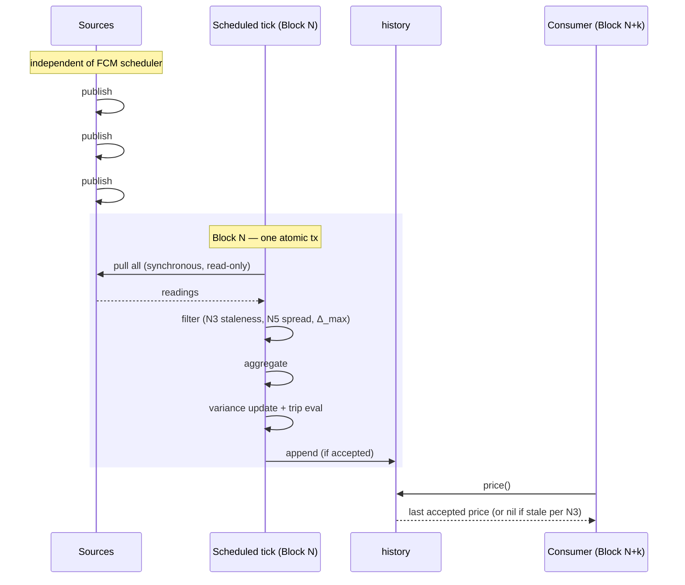

# Flow Credit Markets — Price Oracle

**Status:** Draft
**Owner:** @Jordan Ribbink

> Unless a section explicitly says otherwise, every MUST/SHOULD describes the **mature protocol**. Divergences for the initial deployment are in [Initial Deployment vs. Mature](#initial-deployment-vs-mature-protocol).

---

## Overview

### Problem

FCM must protect collateral, maintain solvency despite large asset shifts, and execute liquidations. Every decision towards those goals depends on a price for each supported token, denominated in the Numeraire. At the time of writing, we use USD as numeraire (see [Numeraire spec](./Numeraire.md)). Relying on a single source for an asset price is generally unsafe — a source can be stale, manipulated, frozen, or compromised, and operating on a bad price produces incorrect valuations, missed liquidations, or wrongful seizures. The protocol therefore needs a *price-of-truth* abstraction that (a) is robust to single-source failure and (b) may return an "I can't answer reliably right now" or otherwise a trustworthy price signal.

### Goal

A minimal `PriceOracle` interface that:

1. Exposes one honest read path: either a reliable price denominated in the oracle's unit of account (for FCM, the USD Numeraire), or `nil`.
2. Accommodates multiple independent underlying price sources without leaking that composition to callers.
3. Composes with later safety additions (notably a volatility circuit breaker) without interface change — layers *wrap* the oracle rather than modify it.
4. No wrong values under failure. Failures surface either as `nil` (per the Nil Contract) or — for read-through implementations — as an irreducible upstream panic (I6). Honest gaps are enumerated in Known Limitations.

### Lifetime

The interface and the requirements on consumers (Caller Contract) are intended to survive unchanged to the mature protocol. Implementation choices (number of sources, staleness bound, presence of a circuit-breaker wrapper, exact aggregation function) will evolve.

## Assumptions

The spec makes the following axiomatic assumptions. If any is violated, the conclusions below do not hold.

- **Independent sources exist.** For each supported token in the mature protocol, there exist ≥ 2 independent price sources — uncorrelated in their failure modes and vulnerability to manipulation. Without this, multi-source aggregation buys no safety over a single feed, and the N5 / spread-check layer degenerates.
- **Sources attest `publishTime` truthfully.** A source MUST report the actual moment its value was observed — not the query time, not the chain's current `block.timestamp`. If a source misreports `publishTime`, staleness checks (N3) are defeated. Staleness is anchored on source-attested `publishTime`, never `block.timestamp`; substituting the latter would launder pull-style stale data (e.g., a Pyth contract sitting unrefreshed) past the staleness check. Real-world clock drift between source-attested time and chain time is absorbed into staleness-bound calibration; suspiciously future-dated readings (buggy or adversarial source) are caught and surfaced as nil via N4.
- **Majority-honest sources (Byzantine bound).** Across N≥3 sources (where N is the number of independent price sources configured for the token), strictly fewer than half are simultaneously compromised or stale; required for median aggregation to be robust. (At N=2 this collapses to "no compromised source" and median collapses to mean — spread check N5 carries the load.)

**Temporary Simplification:** For the product milestone "Rebuild V0.2", we will not satisfy these axioms fully. Specifically, we will only have one true price source denominated in the numeraire. A DEX is used as a secondary price source. However, a DEX will typically not report the prices in the numeraire so prices have to be approximately converted, for which reason the DEX should not be considered a proper price source. We will use the DEX as an input to the Circuit Breaker (discussed below), but not incorporate its potentially imprecise output signal on the happy path in the "price-of-truth".

## Nomenclature

| Term | Definition |
| :--- | :--- |
| **Numeraire** | The protocol-wide unit of account in which FCM denominates all values. By convention the numeraire for FCM is currently the **USD Numeraire** (a `FungibleToken` type representing USD for which no vault ever exists on-chain); this choice is a protocol-level convention and may change. Tokens like pyUSD, USDC, FUSD are *denominated in* the current numeraire. |
| **Unit of Account** (UoA) | The `FungibleToken` type in which prices returned by the oracle are denominated. A Cadence `Type`, not a string. For FCM, always the Numeraire (tentatively USD) by convention. |
| **Price Source** (or *source*) | A producer of pricing data — e.g., on-chain DEX pool, or a signed off-chain feed bridged onto Flow (Pyth, BandOracle). Caution: a `Price Source` might use units of account other than the numeraire for their returned prices. The trust model for price sources is: mostly reliable but not fully trusted. |
| **Independent sources** | Sources whose failure or manipulation modes are uncorrelated. Two DEX pools fed by the same arbitrageur flow are NOT independent; a DEX and a signed off-chain feed ARE. |
| **Staleness bound** | Maximum age of the newest datum a returned price depends on. Measured against source publish time (I7). |
| **δ_cadence** | Breaker-specific: the interval between scheduled `executeTransaction` invocations. Must satisfy T.I (`δ_cadence < stalenessBound`) and T.II (`historyWindow ≥ K · δ_cadence`). |
| **Δ_max** | Max source-time spread per tick: aggregator MUST reject readings with intra-tick spread `maxᵢ tᵢ − minᵢ tᵢ > Δ_max` (see Source-time spread). |
| **σ_scheduler** | Scheduler-slack bound: worst-case excess of actual inter-tick delay over `δ_cadence` (composite-bound term; environmental, not tuned). |
| **ε_skew** | Bound on skew between source-attested `publishTime` and on-chain block time (composite-bound term; see Assumptions). |

## Interface

```cadence
access(all) struct PriceReading {
    access(all) let value: UFix64
    access(all) let publishTime: UFix64
}

access(all) struct interface PriceOracle {
    access(all) let unitOfAccount: Type
    access(all) fun price(ofToken: Type): PriceReading?
}
```

The interface is part of this spec; implementations MUST NOT add methods returning a price without the full safety contract.

- `unitOfAccount` — immutable `let` field, set once at `init`. Type-enforced constancy across the struct's lifetime (invariant I). Single source of truth for the oracle's unit of account; used for the registration handshake (C3).
- `price(ofToken)` — returns non-nil only if every Nil Contract condition holds. Panic behavior is implementation-dependent: read-through implementations (single-source, aggregator) can propagate upstream panics — irreducible at the platform level; breaker-wrapped implementations serve from local state and are structurally panic-free (see I6, C6). Not `view`: implementations may on demand refresh a cache, pull from a price source, or transact cross into Flow EVM (e.g., to call a Pyth update). Side effects MUST NOT alter future observations (invariant II). Querying an unsupported token is a normal `nil` (see N1 below).

**`PriceReading` is the only way to observe a price.** `value` and `publishTime` are bundled in one atomic return so callers cannot observe one without the other. The interface MUST NOT offer a separate `publishTimeOf(token: Type)` getter — a two-call pattern reintroduces a race between the reads and defeats I7.

- `value` — price denominated in `unitOfAccount` per one token, at `publishTime`.
- `publishTime` — source-attested observation time (I7). For aggregators, the oldest contributing source's publishTime (min-semantics); for breakers, the publishTime of the last accepted observation, unchanged.

## Semantics

### Unit of account [UoA]

A non-nil `price(ofToken: T)` is the value denominated in the UoA of a single token of type `T`, at the oracle's current time. For FCM, UoA is always the Numeraire (currently real-world USD represented by `Type<USD>()`, defined in [Numeraire spec](./Numeraire.md)). UoA is a type, not a string, because we want the compiler to reject cross-unit mismatches at registration (see C3 below), not at query time.

### Nil Contract

`price()` returns `nil` when the oracle can't produce a price the caller should rely on. Every implementation MUST return `nil` in at least:

- **N1 — Unsupported token.** The oracle is not configured to price `ofToken`.
- **N2 — Source unavailability.** Any required source returns nil, is missing the expected datum, or schema-mismatches. Source panics during the call are irreducible (see I6) and propagate as tx revert; the aggregator MUST structure its code to minimize additional panic surface. No silent fallback to zero / default / stale.
- **N3 — Staleness.** The newest underlying datum's source-attested `publishTime` is older than the implementation's staleness bound.
- **N4 — Internal inconsistency.** Overflow, unexpected zero, schema mismatch, invalid configuration.
- **N5 — Source disagreement** (multi-source only). Spread across non-nil source values at a single tick exceeds the configured threshold (intra-tick; aggregator does not maintain a spread history).

`nil` is a normal return, not an error. Implementations MUST surface these conditions as `nil` rather than panic; the panic-freedom of `price()` itself is implementation-dependent per I6 (read-through implementations may still propagate upstream panics).

## Invariants

A compliant implementation maintains the following at all times.

- **(I) Identity immutability.** `unitOfAccount` is a `let` field — type-enforced fixed at `init`, never mutates at runtime. The set of tokens the oracle is configured to price is also fixed at `init`. Changing either requires replacing the struct.
- **(II) Query idempotence.** `price()` is not `view` — side effects are permitted. Repeated `price(ofToken: T)` within the same transaction MUST return the same result. Across two `price()` calls in the same block but different transactions, an implementation MAY return updated values if a state-mutating tx (e.g., the breaker's `executeTransaction`) commits between them; consumers requiring snapshot semantics MUST read once per operation (C5).
- **(III) Reliability of non-nil.** A non-nil `price(ofToken: T)` at time `t` is returned only if no Nil Contract condition holds at `t` — i.e., `¬N1 ∧ … ∧ ¬N5`.
- **(IV) No silent substitution.** Non-nil values are freshly computed from sources whose attested publish time is within the staleness bound. Never a default, a cached-last-known-good past bound, or a zero.
- **(V) Source publish-time propagation.** Source-attested `publishTime` values are propagated through aggregation and history without being relabeled with pull time, insertion time, or `block.timestamp`. Type-enforced by `PriceReading.publishTime` being a `let` field set at construction; downstream layers MUST forward it (single-source) or take the `min` across contributing source publishTimes (aggregator).

## Caller Contract

Consumers of `price(ofToken: T)`:

- **C1 — Treat `nil` as a hard stop.** Every decision that depends on the price MUST abort or defer. No substituting a default, stale cache, or last-known-good.
- **C2 — Respect the unit of account.** Returned `UFix64` is in `unitOfAccount` units (by convention the Numeraire). Different-unit conversions are the caller's responsibility.
- **C3 — Verify UoA before first use.** Callers MUST verify, before the oracle is used for the first time (typically at wire-up / registration), that the oracle's `unitOfAccount` is compatible with the unit they expect. By convention, FCM oracles report in the protocol numeraire (currently `Type<USD>()`, see [Numeraire spec](./Numeraire.md)), and FCM consumers realize this check as strict type equality: `assert(oracle.unitOfAccount == Type<USD>(), message: "UoA mismatch")`. Type-enforced constancy via the `let unitOfAccount` field (invariant I) means a single check before first use is sufficient — re-checking per query is not required.
- **C4 — Assume non-determinism across blocks.** `price()` may return different values across blocks. No reliance on monotonicity or bounded rate-of-change. Same-transaction repeats DO return the same value (invariant II), so caching within a single transaction is safe; caching across transactions — even within the same block — is not, since a scheduled state-mutating tx (e.g., the breaker's `executeTransaction`) can interleave. If bounded rate-of-change is needed, wrap the oracle (Extension: Volatility Circuit Breaker).
- **C5 — Read once per operation.** "Operation" = one logical decision (a single position's liquidation check, a single Net Asset Value [NAV] snapshot). Read `price()` once at the start of the operation and use the value throughout. Don't re-read inside loops. For operations that span multiple tokens (basket NAV), read each token's oracle once and treat any nil as all-nil (C1 hard stop applied to the whole basket).
- **C6 — Panic awareness.** A read-through `price()` (e.g., a single-source oracle reaching an external contract) can panic — Cadence cannot catch it; the caller's transaction aborts (see I6). Callers MUST confine reads from such oracles to contexts where transaction abort is acceptable (not batch liquidation; not multi-token NAV where one panic reverts everything). Breaker-wrapped oracles are structurally panic-free and not subject to this restriction.

## Implementer Requirements

### I1 — Multi-source independence. SAFETY-CRITICAL.

The mature protocol requires ≥ 2 **independent** sources, with at least one source that is not derived from on-chain liquidity (e.g., Pyth or BandOracle, the two signed off-chain feeds currently available on Flow). A single source — or multiple sources all sharing a failure mode (e.g., all DEX-spot) — can be stale, frozen, or manipulated with no meaningful cross-check; this limitation cannot be fixed by tuning parameters.

**Axiom:** Some sources might produce `nil` return values, or the oracle might reject some non-nil source prices as outliers or for other reasons (i.e., treat those functionally equivalent to `nil`). We require that strictly less than ⌈N/2⌉ of the configured sources produce `nil`, results that are rejected, or significantly inaccurate results.

*Aggregation ≠ dynamic oracle selection.* Actively selecting oracles (picking among a larger group of available sources based on freshness / deviation) is a disguised fallback chain and explicitly out of scope — distinct from aggregation.

### I2 — No stale-as-fresh.

MUST NOT return a price as current when its underlying datum is older than the staleness bound. When in doubt, nil. For every block in which the oracle returns a non-nil value, the implementation MUST have attempted to query its sources at least once during that block, or — for implementations that refresh on a scheduled cadence rather than per-query — within one scheduled-refresh interval of that block, and attempt to incorporate received values into its price estimate. (Source reads may return nil or be rejected; "attempt" reflects that the happy path is not guaranteed.)

### I3 — No silent degradation.

Any non-steady-state transition from "can produce a price" to "cannot" (e.g. source panic caught, arithmetic fault, schema mismatch) MUST be surfaced observably so off-chain monitoring can detect it. The mechanism (event, observable state field, etc.) is not prescribed.

### I4 — Document every nil condition.

Every implementation MUST enumerate its documented nil conditions in a doc comment, with the configuration parameter that governs each. A reviewer reading only the doc comment MUST be able to predict return values for observable inputs.

### I5 — Non-view discipline.

Implementer guidance for achieving invariant II under a non-`view` `price()`: Implementations MAY have side effects (e.g. lazy cache refresh, pull-source feed advancement, crossing into Flow EVM for Pyth update calls, observability signalling) but MUST ensure same-transaction repeats of `price()` return the same value. Across two `price()` calls in the same block but different transactions, an implementation MAY return updated values if a state-mutating tx (e.g., the breaker's `executeTransaction`) has interleaved. Persistent state mutation (history append, cache write on the scheduled tick) belongs on entitled methods outside this interface, not on `price()` itself.

### I6 — Panic risk.

Cadence has no `try`/`catch`. A `price()` call that crosses into externally-controlled code (any source call) can panic and abort the caller's transaction; the platform offers no way to wrap it. This is not fixable at the implementer level.

The only structurally panic-free `price()` is one that serves from local state. The circuit breaker does this: its `price()` reads `history.last` off a local resource; the upstream read happens in `executeTransaction` (a single scheduled tx that queries the wrapped aggregator), so any upstream panic reverts that tick, not the consumer's `price()`.

Implementers of read-through oracles SHOULD use defensive access (nil-check `borrow()`, no force-unwraps, checked arithmetic) so their OWN code doesn't add panic surface on top of the upstream one. This is hygiene — fewer wasted scheduled ticks, cleaner diagnostics — not a safety guarantee.

Consumer responsibility: see C6.

### I7 — Honor source publish time; never relabel.

Each source datum carries an attested publish time (Pyth `publishTime`, BandOracle's quote timestamp, DEX pool block time of last trade). Staleness and deviation checks MUST use that time, not the aggregator's own pull / insertion time. An implementation that relabels silently launders stale data past the staleness check. A future-dated publish time (clock skew, adversarial) MUST trigger nil via N4.

## Authorities

- **Query path** — any caller. `price()` is non-`view` (to allow event emission, lazy-refresh patterns, and EVM-side operations — e.g., triggering a Pyth price update on Flow EVM) but bound by invariant II — same-transaction repeats return the same value (cross-tx same-block reads may diverge if a scheduled state-mutating tx interleaves).
- **Scheduled-tx entitlement** — scoped to the circuit breaker's `CircuitBreaker.executeTransaction` (called by `FlowTransactionScheduler`). Not callable by public traffic.
- **Deployment** — creating, wiring, and retiring oracles at the protocol layer is outside this interface. Deployed oracles are immutable (invariant I); any change requires recreation.

## Safety and Liveness

Goal:
- For **safety**, we need to show that under normal operations with the scheduled updates running and at least the minimal number of healthy sources, consumer produces the correct price (i.e. satisfying implementer requirements (I1) - (I7)).
- For **liveness**, under nominal operation (sources healthy, scheduler running), consumer queries return a non-nil reliable price within the composite bound.

Both arguments proceed by scenario walk.

### Scenario a — nominal operation

Sources publish new data; the scheduled update pokes on cadence; aggregator (or breaker on top of aggregator) records successful observations; consumer queries read `history.last` and receive non-nil prices. (I) is type-enforced: `unitOfAccount` and `_token` are immutable `let` fields. (II) holds because breaker state is mutated only by `executeTransaction`, never from `price()` (see B.III). (III) and (IV) hold by *check*: the scheduled update gates appends on N3/N5/I7, so non-nil implies all Nil conditions are negated; substitution is forbidden by the no-default rule (IV); publish time propagates through (V).

**Flow:**



Composite latency from source publish to consumer-readable value is bounded as in [Composite bound](#invariants-and-timing-bounds).

### Scenario b — transient failure (source nil, spread spike, breaker trip)

A source drops, sources diverge, or the current observation deviates past the breaker's threshold. The scheduled poke fails → `history` is **not** appended (B.IV atomic per-tick). The previous tail entry remains until it ages out via N3; during that window, consumers see the last accepted value (still within the staleness bound at acceptance). If the failure resolves within the staleness bound, the next successful poke appends — automatic recovery (T.IV). If the failure persists beyond the bound, `price()` returns nil until resolution. No consumer ever observes a value that violated the trip condition at acceptance time.

### Scenario c — persistent failure (scheduler stall, state-resource destroyed, source permanently compromised)

Scheduled tx stops running (scheduler stall, operator action, bug). The most recent accepted observation is not refreshed. Once it ages past the staleness bound, `price()` returns nil via N3 (B.V + T.I). If `CircuitBreaker` is destroyed, the capability borrow returns nil and `price()` returns nil (per Storage and lifecycle teardown). Consumers fail closed. Recovery requires operator intervention (restart scheduler, redeploy state, swap sources).

### Scenario d — warm-up

Before the first successful poke of a freshly-deployed breaker, `history` is empty. `price()` returns nil. No bootstrap value, no default. Consumers must tolerate the warm-up window between breaker creation and the first accepted observation.

**Conclusion.** In all four scenarios, safety holds (no non-nil wrong value). Liveness holds trivially in scenario a, recovers automatically in b and d, and requires operator action in c. This matches the intended design: failures are transient by default, structural compromise is operator-escalated.

## Extension: Multi-Source Aggregator

Required by the mature protocol. The aggregator is the **per-token price producer**: it pulls current observations from N independent sources, applies safety checks, returns an aggregate. The instantaneous aggregated price is derived from the *latest* source prices that are still within the staleness interval, pass optional outlier checks (for later versions), and are not `nil`.

### Design: stateless, live-query

The aggregator is a pure view over live source capabilities. On each `price()` call: pull, check, aggregate, return. This is read-through — upstream source panics propagate through `price()` per I6; breaker-wrapping (next section) provides the panic-free surface. No cache, no history, no scheduled updates at this layer.

Rationale:
- Combining N current observations is a pure function; giving it state would be bolting on work that belongs in a caching/analysis layer above (such as the breaker).
- Consumer efficiency comes from a caching layer above (such as the breaker, which caches as a byproduct of its deviation check). Without one, consumers pay O(N) per query — acceptable at initial scale.
- No stored state, no storage fee, no scheduled-transaction dependency at this layer.

### Sketch

```cadence
access(all) struct AggregatorOracle: PriceOracle {
    access(all) let unitOfAccount: Type
    access(self) let _token: Type
    access(self) let _sources: [{PriceOracle}]
    // plus config for staleness (N3), spread (N5), aggregation

    access(all) fun price(ofToken: Type): PriceReading? {
        if ofToken != self._token { return nil }
        // 1. Pull PriceReading from each source (borrow-checked, no force-unwraps per I6).
        // 2. For each source: treat as nil if reading is nil OR publishTime older than staleness bound.
        //    Aggregated → N2 nil ONLY if too many sources nil/stale (filter-and-quorum).
        // 3. Spread across non-nil source values at this tick > threshold → N5 nil.
        // 4. Apply aggregation function (e.g. median or mean) to non-nil source values.
        // 5. Return PriceReading(value: aggregate, publishTime: min(contributing source publishTimes)).
        return nil  // placeholder
    }
}
```

### Outlook on aggregation function for more mature product versions

Open question (Open Questions). Candidates:

- **Arithmetic mean + N5 spread check** — the MVP choice. At N=2 (Pyth + BandOracle, the two signed off-chain feeds adopted at launch), median collapses into mean anyway. Mean is outlier-sensitive on its own, so the N5 spread check is load-bearing — it IS the outlier defense. Not the choice of any mature safety-oriented on-chain oracle (they all use median with larger N); appropriate for launch given our source count.
- **Median** — Byzantine-robust to `(N−1)/2` compromised feeds; meaningful only at N≥3. Used by MakerDAO Medianizer, Chainlink OCR (Data Feeds), and Band Protocol. Caution: expensive to compute on-chain. A robust default once we can onboard additional independent sources (DEX-derived, additional bridges) — research item for mature launch.
- **Weighted median** — per-source weights, typically inverse of stated confidence. Used by Pyth Network across its publishers. Not viable at FCM launch because only Pyth publishes confidence on Flow; BandOracle and DEX sources don't. Possible later if we standardize confidence across adopted sources. Research item for mature launch.
- The **Geometric Mean** would be a viable candidate to consider here, because the geometric mean dampens extreme outliers compared to the arithmetic mean. (For this reason Uniswap V3 uses the geometric mean too, but in a different context).


## Extension: Volatility Circuit Breaker

The volatility circuit breaker (optional in the initial deployment, mature MUST) is a *temporal* safety layer that wraps the aggregator. Complementary to the *spatial* source-spread check (N5): N5 catches **single-source manipulation** (one source disagreeing with the others — caught per-tick by spread); the breaker catches **correlated fast movement of the aggregate itself** (median shifting too quickly, e.g., all sources reflecting a flash-crash or a coordinated manipulation across venues) — which N5 cannot see because every source agrees.

### Scope — what the breaker is measuring

The breaker sits between the aggregator (provider of price estimates) and the consumers of the price-of-truth. It is the last stage, effectively labelling the aggregated price as trustworthy provided it passes the breaker. Its **input** is the aggregator's output stream `{(pₖ, τₖ)}`, where `pₖ` is the aggregated price at tick `k` and `τₖ` is the corresponding publish-time anchor (min-semantics across contributing sources). Its **output** — the trip-gated, cached subset accepted into `history.last` — is the sole price of record that consumers (ALP, FYV) read for liquidation decisions.

The variance $\hat{\sigma}^2$ is computed on the raw input stream (every observation, regardless of trip outcome) so the breaker can detect anomalies in what the aggregator is producing before those anomalies become the protocol's price.

Concretely: if `pₖ` jumps 30% while the underlying asset `X(t)` (the latent true price process) jumps 2%, the breaker trips and the 30% move never reaches the protocol — `history.last` stays at the last accepted value until the regime stabilizes or staleness fires nil. Conversely, if `pₖ` smoothly tracks `X(t)`, observations flow through normally. The breaker is not trying to recover the latent asset's "true" volatility; it's measuring the statistic of the aggregator's output because that stream produces the protocol's price of record.

**Scope assumption.** This framing assumes FCM's protocol actions use `pₖ` as the sole price of record. If the protocol adds alternate price paths (manual overrides, backup feeds, hybrid decision trees), the breaker's narrow `pₖ`-anomaly scope no longer covers liquidation safety and this section must be revisited.

### Design: wrap, don't bake in; aggregate-level layering

Breaker wraps an already-aggregated `PriceOracle`:

```
CircuitBreakerOracle  ← temporal check
  └── AggregatorOracle  ← spatial check (N5)
        ├── Source A
        └── Source B
```

**Why wrap at the aggregate level, not per-source** (short version): under N5, per-source temporal checks are redundant for single-source manipulation — spread already catches it. The remaining threat (correlated fast movement across sources) is mathematically more detectable at the aggregate layer — under iid normality with N sources, aggregate-level trip fires at `k·σ` while per-source-with-FPR-correction fires at `k'·σ > k·σ`. Choice follows from N5 carrying the single-source-manipulation load independently. If N5 is ever weakened, revisit this layering.

### Sketch (struct + resource)

Mutable persistent state (`history`) is a `CircuitBreaker` *resource* stored on a protocol-controlled account. The `CircuitBreakerOracle` *struct* holds a capability to that resource and serves reads on the query path. **Why split:** the `PriceOracle` interface is a struct interface — the query surface must be a cheap-to-copy struct — but mutable state belongs in a resource where entitlements gate writes. Split gives us both: reads through the struct, mutation behind an entitled capability to the resource.

```cadence
// The resource holds state, config, AND acts as the scheduled-transaction
// handler. Implementing TransactionHandler lets FlowTransactionScheduler
// call directly into this resource — no separate handler needed.
access(all) resource CircuitBreaker: FlowTransactionScheduler.TransactionHandler, ViewResolver.Resolver {
    // Immutable identity + config (set at init).
    access(all) let unitOfAccount: Type
    access(self) let _token: Type
    access(self) let _upstream: {PriceOracle}                // the oracle being wrapped (embedded struct)
    // plus config for staleness bound (N3), deviation threshold (trip), history window, etc.

    access(self) let _history: [PriceReading]                // accepted observations; consumers read via current()
    access(self) var _prevObservation: PriceReading?         // most recent observation (accepted OR tripped); base for the (μ̂, σ̂²) update chain
    access(self) var _meanReturn: UFix64                     // running mean of Δt-normalized log returns
    access(self) var _sigmaSquared: UFix64                   // running variance estimate (mean-corrected)

    // Public method surface — external callers go through methods, not field reads.
    access(all) view fun token(): Type { return self._token }

    // Single-point read: returns the last accepted reading iff still within the staleness bound.
    //   - history empty → nil (warm-up).
    //   - history.last aged past staleness → nil (N3).
    //     This is how failed ticks (panic / stall / persistent trip) surface
    //     to consumers: history stops advancing, staleness fires nil.
    //   - otherwise → history.last.
    access(all) view fun current(): PriceReading? {
        return nil  // placeholder
    }

    // Called by FlowTransactionScheduler on the configured cadence.
    // Signature matches FlowTransactionScheduler.TransactionHandler exactly.
    access(FlowTransactionScheduler.Execute)
    fun executeTransaction(id: UInt64, data: AnyStruct?) {
        // 1. Pull (pₖ, τₖ) from self._upstream.price(ofToken: self._token).
        //    If reading is nil → no-op this tick.
        // 1a. If self._prevObservation is non-nil and τₖ ≤ self._prevObservation.publishTime
        //     → no-op this tick. Aggregator min-semantics across a fluctuating
        //     contributing-source set can yield a non-monotone τₖ; Δτ ≤ 0 would
        //     break √Δτ in step 3 (undefined) and produce a non-positive
        //     Δτ/τ_half exponent in step 5, yielding αₖ ≤ 0 — collapsing the
        //     update at Δτ = 0 and inverting it at Δτ < 0.
        //     Skipping is consistent with B.IV (atomic per-tick: commit all or
        //     nothing) and T.III (no-op on non-advancing publish time).
        // 2. If self._prevObservation is nil (warm-up) → set it, skip σ̂²/trip eval.
        // 3. Compute uₖ = log(pₖ / prev.value) / √(τₖ − prev.publishTime); δₖ = uₖ − self._meanReturn.
        // 4. Evaluate trip: |δₖ| > k · sqrt(self._sigmaSquared) ?
        //    If trip → emit trip event; DO NOT append to history.
        //    Else   → append reading to history; emit acceptance event.
        // 5. Update self._meanReturn and self._sigmaSquared via mean-corrected EWMA (always, regardless of trip).
        // 6. Prune history outside [τₖ − historyWindow, τₖ].
        // 7. Update self._prevObservation = reading (always, regardless of trip).
    }

    // ViewResolver.Resolver conformance (required by TransactionHandler).
    access(all) view fun getViews(): [Type] { return [] }
    access(all) fun resolveView(_ view: Type): AnyStruct? { return nil }
}

// Queryable shell held by consumers. Forwards to the underlying CircuitBreaker.
access(all) struct CircuitBreakerOracle: PriceOracle {
    access(all) let unitOfAccount: Type
    access(self) let _breaker: Capability<&CircuitBreaker>
    access(self) let _token: Type

    init(breaker: Capability<&CircuitBreaker>) {
        // Init-time panic is loud (deployment fails) and acceptable — the oracle
        // never exists in a broken state. Post-init, queries never panic.
        let b = breaker.borrow() ?? panic("CircuitBreakerOracle: capability does not resolve")
        self.unitOfAccount = b.unitOfAccount
        self._breaker = breaker
        self._token = b.token()
    }

    access(all) fun price(ofToken: Type): PriceReading? {
        // 1. Wrong token (ofToken != self._token) → N1 nil.
        // 2. Breaker capability no longer resolves → nil.
        // 3. Otherwise forward to breaker.current() — which returns the last
        //    accepted reading if still within the staleness bound, else nil.
        // No staleness check here; single-point guard lives in current().
        return nil  // placeholder
    }
}
```

### Storage and lifecycle

`CircuitBreaker` lives at a deterministic path on a protocol-controlled account (oracle contract account or dedicated operator account). One per wrapped token.

- **Funding.** Protocol treasury funds `MinimumStorageReservation` — same mechanism as scheduled-tx execution. Bounded: `O(maxHistoryEntries × sizeof(PriceReading))`; `maxHistoryEntries` capped at init, never grows.
- **Creation.** Protocol deployment creates the resource at init and issues a public `Capability<&CircuitBreaker>` for the `CircuitBreakerOracle` struct to hold. Scheduled invocation of `executeTransaction` is registered separately via `FlowTransactionScheduler.schedule(...)`, which manages the `Execute`-entitled handle internally. An off-chain-indexable creation event is emitted.
- **Teardown.** Protocol deployment destroys the resource, paired with descheduling the scheduled tx. Downstream borrows return nil → consumers fail-closed. A matching teardown event is emitted.
- **Capability topology enforces invariant II.** The struct's capability is unentitled, and all resource state is `access(self)` — no external reference can mutate state regardless of what caller holds the cap.

### Scheduled execution is required

The breaker depends on `FlowTransactionScheduler` calling `executeTransaction` on a documented cadence. Without a running schedule, the most recent accepted observation ages past the staleness bound (N3) and consumers fail-closed.

**Panic behavior in `executeTransaction`.** An upstream-source panic reverts the scheduled tx — history is unchanged (safe) but the tick is lost. Implementations MUST minimize their *own* panic surface here so tick loss only reflects real upstream failure, not self-inflicted bugs. Detection and recovery strategies (inferring a missed tick, rescheduling, health events) are implementation choices and not prescribed.

### Metric shape

**Recommended default: time-weighted mean-corrected EWMA of return variance with configurable trip threshold.**

### State

Per breaker:
- `history: [PriceReading]` — **accepted observations only**. Serves consumers via `history.last`.
- `prevObservation: PriceReading?` — **most recent observation** (whether accepted or tripped). Used as the base for each tick's return computation.
- `μ̂` — running mean of Δt-normalized log returns.
- `σ̂²` — running variance estimate (mean-corrected via [West's weighted incremental algorithm](https://en.wikipedia.org/wiki/Algorithms_for_calculating_variance#Weighted_incremental_algorithm)).

### Per-tick update

On each scheduled tick, observe `(pₖ, τₖ)` from upstream. Let `(pₚ, τₚ) = prevObservation` be the previous observation:

```
Δτₖ  =  τₖ  −  τₚ
uₖ   =  log(pₖ / pₚ)  /  √Δτₖ                                   (Δt-normalized log return)
αₖ   =  1  −  1 / 2^(Δτₖ / τ_half)                                (time-adaptive smoothing; τ_half = half-life)
μ̂ₖ   =  μ̂ₖ₋₁  +  αₖ · (uₖ − μ̂ₖ₋₁)                              (running mean update — always applied)
σ̂²ₖ  =  (1 − αₖ) · σ̂²ₖ₋₁  +  αₖ · (uₖ − μ̂ₖ)(uₖ − μ̂ₖ₋₁)        (mean-corrected EWMA variance update — always applied)

Trip   =  |uₖ − μ̂ₖ₋₁|  >  k · σ̂ₖ₋₁                              (deviation from tracked mean exceeds threshold)

if not Trip:  append (pₖ, τₖ) to history       (cache advances, consumers see new value)
always:       prevObservation = (pₖ, τₖ)       (measurement chain advances regardless of trip)
```

> **Implementation note:** Cadence does not currently expose a native `2^(·)`; production implementations should use range reduction with a precomputed binary-fraction lookup table (the standard on-chain fixed-point approach, see [ABDK Math 64.64](https://github.com/abdk-consulting/abdk-libraries-solidity)'s `exp_2` for prior art).
>
> **Warm-up:** `μ̂` and `σ̂²` initial values, and the number of ticks before trip evaluation is performed, are implementation-defined. Consumers see nil from `price()` during warm-up regardless (since `history` is empty until the first acceptance).

### What this separates

- **`(μ̂, σ̂²)`** are pure functions of the observed stream — updated every tick via the `prevObservation` chain. Adapt to regime changes naturally through the EWMA.
- **`history` (cache)** only advances on accepted observations — consumers see the last-known-good value; trip freezes it until staleness fires nil.
- **`prevObservation`** is pure measurement state — tracks the raw stream independently of what's been served.

Three concerns, three state variables, no overloading.

Parameters (calibration open per asset, see Open Questions):
- `τ_half` — EWMA half-life; the elapsed time after which a sample's weight halves. Matches the timescale over which the breaker adapts.
- `k` — trip threshold in units of `σ̂`. Higher `k` → fewer false trips, more false negatives. Calibrated empirically per asset.

Chosen because: handles irregular observation spacing natively (via Δt-normalization); O(1) state and O(1) compute per tick; volatility-adaptive (trip threshold scales with recent volatility rather than a fixed deviation bound); under the `Δ_max` source-spread bound (Source-time spread, below), bias is upward and bounded — breaker fails *safe* (less sensitive, not more). Trade-off: trips more often during sustained legitimate moves than a zero-mean form would; accepted because the alternative absorbs drift into σ̂² and could mask multi-tick cross-venue manipulation that N5 cannot see (all sources agree).

Alternative metrics remain open.

**Source-time spread.** Let tick `k` produce aggregate reading `(p⁽ᵏ⁾, τ⁽ᵏ⁾)` from N source observations `{(vᵢ⁽ᵏ⁾, tᵢ⁽ᵏ⁾)}`, where `vᵢ⁽ᵏ⁾` is the value reported by source `i` at tick `k` and `tᵢ⁽ᵏ⁾` is its source-attested observation time:

```
p⁽ᵏ⁾  =  g({vᵢ⁽ᵏ⁾})                              (aggregation function — median / mean / etc.)
τ⁽ᵏ⁾  =  minᵢ tᵢ⁽ᵏ⁾                              (conservative staleness bound — Invariant V)
Δ⁽ᵏ⁾  =  maxᵢ tᵢ⁽ᵏ⁾  −  minᵢ tᵢ⁽ᵏ⁾   ≥  0        (intra-aggregate source-time spread)
```

The aggregate's value `p⁽ᵏ⁾` is computed from measurements taken over the interval `[τ⁽ᵏ⁾, τ⁽ᵏ⁾ + Δ⁽ᵏ⁾]` — it is *not* a point sample at `τ⁽ᵏ⁾`.

Any deviation metric `D({(p⁽ᵏ⁾, τ⁽ᵏ⁾)}_k)` that treats the series as point samples inherits a bias term `ε({Δ⁽ᵏ⁾}_k)`:

```
D_observed  =  D_true  +  ε({Δ⁽ᵏ⁾})
```

`ε` is non-zero mean when spreads correlate with price direction (e.g., one source reliably publishes slower during volatile periods). Variance estimators in particular are *inflated* by this noise.

**Required: the aggregator MUST enforce `Δ⁽ᵏ⁾ ≤ Δ_max`** and reject (nil) aggregations exceeding it. `Δ_max` is chosen so `ε` is dominated by signal in the regime of interest — concretely, small relative to the chosen metric's decay time (e.g., `Δ_max ≪ τ_half` for the recommended EWMA variance, so aggregate-blend bias is a small fraction of `σ̂²`).

The recommended default metric (see Metric shape, below) is valid under this bound. Alternative metrics that are *intrinsically* spread-aware — modeling `p⁽ᵏ⁾` as a window average rather than a point sample, using time-density-normalized returns, etc. — could relax this bound but must define their `ε` explicitly, not hand-wave it.

### Invariants and timing bounds

- **B.I Fail-closed on trip.** When a deviation check rejects an observation, breaker state is unchanged. Consumers continue to see the previously-accepted value until it ages past the staleness bound (N3). Trip signalling to off-chain monitoring is covered by I3.
- **B.II Publish-time discipline.** Specialization of Invariant V: every observation recorded by the breaker carries a source-attested `publishTime`, never relabeled with pull-time, insertion-time, or `block.timestamp`.
- **B.III Query idempotence.** Specialization of Invariant II / I5: consumer reads cannot mutate breaker state; state mutation is restricted to the scheduled-tick context. Same-transaction reads return the same value; same-block reads across different transactions return the same value unless a scheduled `executeTransaction` interleaves.
- **B.IV Atomic per-tick update.** Each scheduled tick either commits its state transition — new observation, any pruning — in full, or commits nothing. No partial states.
- **B.V History monotonic and window-bounded.** The internal observation log is strictly increasing in `publishTime`; retained entries lie within a configured window ending at the most recent observation.
- **B.VI Per-observation bound.** For every observation served to consumers, the breaker's deviation check held at acceptance: under the recommended EWMA metric, `|δₖ| = |uₖ − μ̂ₖ₋₁| ≤ k · σ̂ₖ₋₁` (Per-tick update). Alternative metrics MUST state their own per-observation bound explicitly.
- **B.VII Immutable breaker config.** Extends Invariant I: breaker configuration — deviation threshold, history window, staleness bound, scheduled-tick cadence, aggregator source — is fixed at construction. Changing any requires redeployment.

**Timing:**

- **T.I** `δ_cadence < stalenessBound`. Otherwise `history.last` ages past the staleness bound between ticks even under nominal operation. Scheduler stalls cause N3 nil — fail-closed on outage.
- **T.II** `historyWindow ≥ K · δ_cadence` for `K ≥ 2`, where `K` is the integer factor expressing how many cadence periods the breaker's history window spans. K = 2 is the structural floor — deviation is undefined with a single observation. Practical K is metric-dependent and open (see Metric shape).
- **T.III Event-driven.** Trip evaluation and state update only on strict publish-time advance (τₖ > τₖ₋₁). Ticks where τₖ ≤ τₖ₋₁ — same-time pokes, or non-monotone aggregator publish times produced by a fluctuating contributing-source set under min-semantics — are no-ops. This guards `√Δτ` and the EWMA weight αₖ in the per-tick update. Implementations MUST be robust to irregular trigger frequencies (skipped or delayed ticks under scheduler overload).
- **T.IV Automatic recovery.** No persistent "broken" flag. Next non-tripping observation appends to `history` and advances the served reading. Transient failures resolve automatically; structural compromise escalates to operator intervention (different from Liquity's persistent-break model).

**Composite bound (end-to-end):** for every non-nil `p` returned at wall-clock `t` with source publish time `τ`:

```
t − τ  ≤  stalenessBound_breaker  +  stalenessBound_aggregator  +  δ_cadence  +  σ_scheduler  +  ε_skew
```

Components: the breaker's staleness gate, the aggregator's staleness gate, the worst-case wait between scheduled ticks, scheduler-slack (actual inter-tick delay may exceed the nominal cadence), and clock-skew between source-attested `publishTime` and on-chain block time (per Assumptions). Tune so the composite bound is acceptable for risk-critical reads; `σ_scheduler` and `ε_skew` depend on the deployment environment and are bounded rather than tuned.

## Initial Deployment vs. Mature Protocol

This spec describes the mature protocol. The initial deployment may diverge as temporary shortcuts — each is well-encapsulated so mature-protocol progression is an implementation change, not a spec change.

- **Single-source oracle (possibly).** If approved under the beta constraints (invite-only, FYV-only, <$1M exposure), the initial deployment may ship with one source. Mature MUST NOT.
- **No volatility circuit breaker.** Optional initially; mature MUST. Progression: wrap the aggregator with `CircuitBreakerOracle`; no interface change.

## Open Questions

- **Catalog of acceptable source pairings** — which count as "independent" under I1, under what market assumptions. Research before mature launch.
- **Staleness bound.** Implementation-defined per source type; must satisfy T.I for the breaker's cadence.
- **Spread metric and threshold for N5.** To be calibrated against source-disagreement noise.
- **Breaker scheduled-tx cadence (`δ_cadence`).** Must satisfy T.I and T.II. Default TBD.
- **Breaker EWMA parameters** `τ_half` (half-life) and `k` (z-score trip threshold). Empirical per token. Alternative metric choice remains open if calibration proves unworkable.
- **Source-time spread bound** `Δ_max`. Tight enough to keep aggregate-blend bias small relative to `τ_half`; loose enough not to starve the aggregator under realistic cross-source cadence (Pyth sub-second vs. BandOracle minutes).
- **Exact mathematical formulas** for the breaker metric and aggregator remain open. The recommended defaults in this spec are a starting point; specific functional forms are subject to change during empirical calibration.
- **Single-source failure policy.** At launch (N=2) the aggregator nils on any source failure — filtering to N=1 is indefensible. At mature (N≥3+ with median) we should shift to filter-and-quorum; MakerDAO Medianizer's `bar` parameter is the clearest precedent (minimum number of valid signed feeds required for a non-nil aggregate). Plan: bake in a minimum-quorum parameter now, set to `N` at launch, relax once we have enough sources for filtering to preserve Byzantine tolerance. Breaker does NOT trip on source failures — staleness pathway handles fail-closed.

## Non-Goals

- **Fallback chains / dynamic oracle selection.** Distinct from aggregation; disguised single-source. Out of scope.
- **On-chain calibration of breaker parameters.** Parameters are fixed at deployment.

## Known Limitations

Deliberate acknowledgments where the spec's safety model has honest gaps.

- **Capability-swap with matching UoA.** A consumer's stored capability can be re-bound to a different oracle after the C3 registration-time check; a swap to an oracle with the same UoA (e.g., WETH/USD → WBTC/USD) goes undetected. The `let unitOfAccount` field rules out a single oracle changing its own UoA — not capability-level swaps. Future mitigation: pin source identity at registration and re-verify per use.


